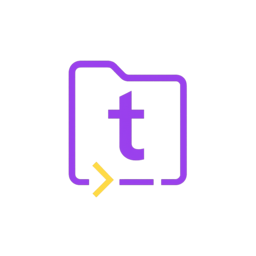

<div align="center">



# tidy

**Smart file organizer for your terminal**

*Organize files by content — not just extension. Preview before moving. Undo anything.*

[](https://go.dev)
[](LICENSE)
[](#installation)
[](https://github.com/YousefMohiey/tidy/releases)

[Features](#features) • [Installation](#installation) • [Usage](#usage) • [Configuration](#configuration) • [Architecture](#architecture)

</div>

---

## Installation

### Linux

#### Debian / Ubuntu (.deb)
```bash
wget https://github.com/YousefMohiey/tidy/releases/latest/download/tidy-1.2.0-amd64.deb
sudo dpkg -i tidy-1.2.0-amd64.deb
```

#### Fedora / RHEL (.rpm)
```bash
wget https://github.com/YousefMohiey/tidy/releases/latest/download/tidy-1.2.0-1.x86_64.rpm
sudo rpm -i tidy-1.2.0-1.x86_64.rpm
```

#### Portable binary
```bash
wget https://github.com/YousefMohiey/tidy/releases/latest/download/tidy-linux-amd64
chmod +x tidy-linux-amd64
sudo mv tidy-linux-amd64 /usr/local/bin/tidy
```

### macOS

```bash
# Intel Mac
curl -L https://github.com/YousefMohiey/tidy/releases/latest/download/tidy-macos-intel -o tidy
chmod +x tidy && sudo mv tidy /usr/local/bin/

# Apple Silicon
curl -L https://github.com/YousefMohiey/tidy/releases/latest/download/tidy-macos-arm64 -o tidy
chmod +x tidy && sudo mv tidy /usr/local/bin/
```

### Windows

Download `tidy-Setup-x.x.x.exe` from [Releases](https://github.com/YousefMohiey/tidy/releases).  
Installs to `%LOCALAPPDATA%\Programs\tidy`, adds to PATH, creates Start Menu and Desktop shortcuts.  
User-scope only — no admin required.

### Build from source

```bash
git clone https://github.com/YousefMohiey/tidy.git
cd tidy
go build -o tidy ./cmd/tidy/
sudo mv tidy /usr/local/bin/
```

---

## Features

| | |
|---|---|
| **Content-aware sorting** | Reads file magic bytes, not just extensions |
| **Interactive TUI dashboard** | Organize, preview, dedup, undo, and watch from one screen |
| **Folder browser** | Navigate visually or type/paste paths directly (`g` key) |
| **Preview mode** | See exactly what will move before touching anything |
| **Full undo** | Journaled with atomic crash-safe saves — undo any batch |
| **Undo history** | Browse and undo from past operations |
| **Duplicate detection** | SHA256 hashing with speed-optimized cache |
| **Duplicate resolver** | Select which copies to keep/delete with freed-space report |
| **Watch mode** | Auto-organize new files in real-time |
| **Tree preview** | Visualize file categorization before organizing |
| **Progress reporting** | Live counts during organize and dedup |
| **11 categories** | Images, Documents, Videos, Audio, Archives, Code, Fonts, Executables, Disk Images, Ebooks, 3D Models |
| **300+ file types** | `.jpg` to `.heic`, `.stl` to `.epub` |
| **Cross-platform** | Linux, Windows, macOS — single binary, no deps |
| **Smart renaming** | `photo.jpg` → `photo_1.jpg` on name collisions |
| **YAML config** | Customize rules and categories |
| **Windows context menu** | Right-click any folder → Organize with tidy |
| **ANSI colors** | Full color on all terminals including Windows CMD |

---

## Usage

### Interactive dashboard

```bash
tidy
```

**Keyboard shortcuts:**

| Key | Action |
|---|---|
| `e` | Browse and select directory |
| `o` | Organize files |
| `p` | Preview (dry-run) |
| `d` | Scan for duplicates |
| `u` | Undo (with confirmation) |
| `w` | Toggle watch mode |
| `g` | Type/paste a path directly |
| `s` | Select current directory |
| `← →` | Move cursor in path input |
| `Backspace` | Go to parent directory |
| `1-4` | Switch tabs |
| `j/k` or `↑/↓` | Navigate / scroll |
| `q` | Quit |

### CLI

```bash
tidy organize ~/Downloads          # Organize files
tidy organize --dry-run ~/Downloads # Preview only
tidy watch ~/Downloads             # Watch + auto-organize
tidy undo                          # Undo last operation
tidy dedup ~/Downloads             # Find duplicates
tidy dedup ~/Downloads --json      # JSON output
tidy status                        # Last operation summary
tidy organize ~/Downloads --config rules.yaml  # Custom rules
```

---

## Configuration

```yaml
rules:
  - name: Images
    extensions: [jpg, png, gif, webp, heic]
    magic_bytes: [image/jpeg, image/png]
    destination: Images
    patterns: []

  - name: Custom
    extensions: [custom, special]
    magic_bytes: []
    destination: Custom
    patterns: ["*.backup"]
```

> Destinations are validated for path traversal safety (`../../etc` is rejected).

---

## Architecture

```
tidy/
├── cmd/tidy/          # CLI entry + Windows color support
├── internal/
│   ├── config/        # YAML config + path validation
│   ├── rules/         # 3-phase matching engine
│   ├── detector/      # MIME detection via magic bytes
│   ├── organizer/     # File moves + atomic journal/undo
│   ├── watcher/       # fsnotify watcher (async organize)
│   ├── dedup/         # SHA256 dedup + persistent cache
│   ├── paths/         # Platform data directories
│   ├── notify/        # Desktop notifications
│   └── tui/           # 9 Bubble Tea TUI modules
├── installer/         # NSIS, RPM, DEB packaging
├── build.sh           # Cross-platform build
└── config.yaml        # Default rules
```

## Building

```bash
./build.sh
# Output: tidy-Linux-amd64, .deb, .rpm, Windows .exe, macOS binaries
```

## License

[MIT](LICENSE)
